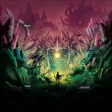

<html>
  <head>
    <link rel="stylesheet" href="css/boostrap.min.css">
    <link rel="stylesheet" href="css/boostrap-theme.min.css">
    
    <title>Titutlo</title>
  </head>
  <body>
    <h1>Titulo</h1>
    <h2>Titulo2</h2>
    
<a href="botones.html">Using custom go back and forward buttons/a><

    
    

     

       

       
<a href="botones.html">Using custom go back and forward buttons/a>

      
       
 
  
